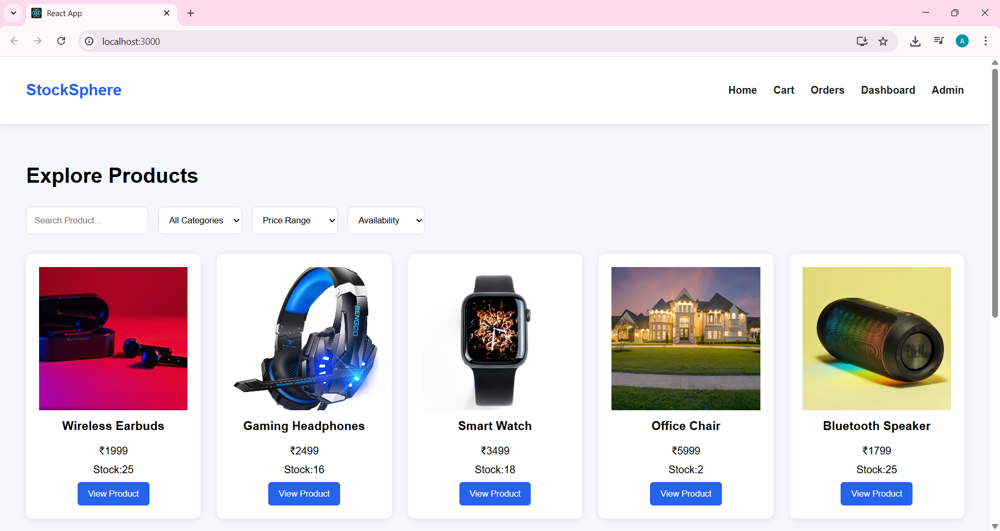
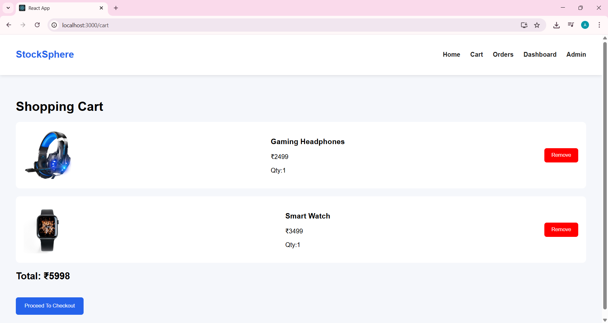
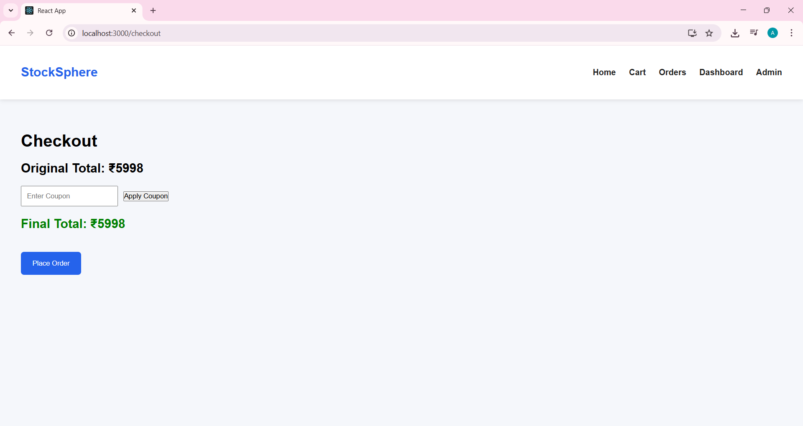
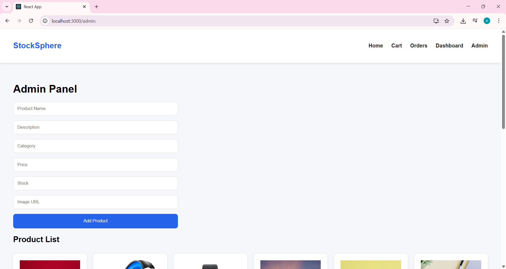
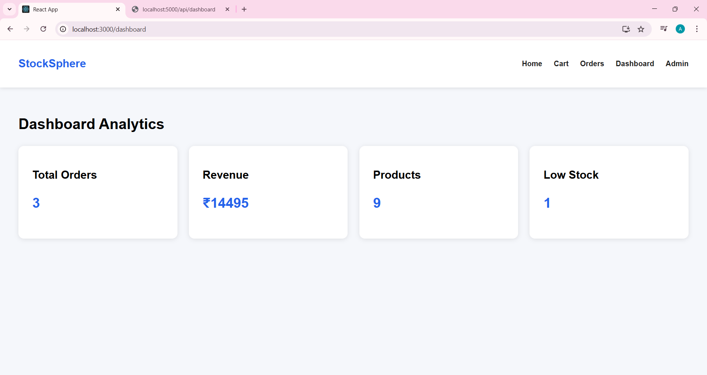
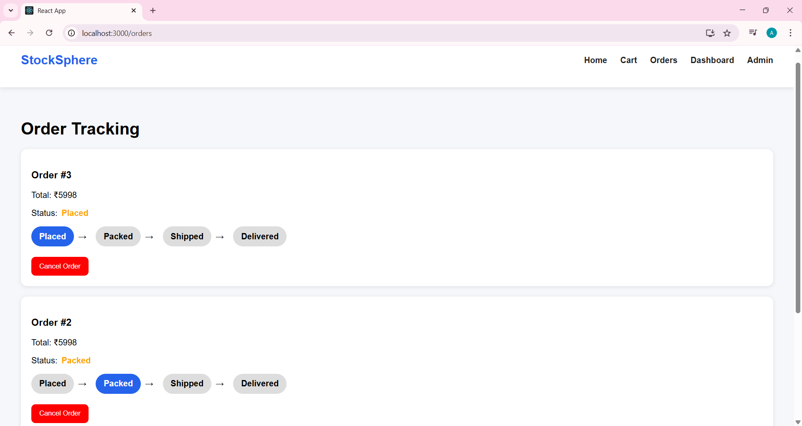

# StockSphere Commerce

A full-stack e-commerce order and inventory management platform built using **React.js, Node.js, Express.js, and SQLite**.

## Project Overview

StockSphere Commerce is a professional e-commerce platform where customers can browse products, add items to cart, place orders, and track order status. Admins can manage products, stock, and monitor dashboard analytics.


## Features

### Customer Features

- Browse products
- Search products
- Filter by category and price
- Product details page
- Add to cart
- Checkout system
- Coupon discount system
- Invoice PDF generation
- Order tracking
- Order history

### Admin Features

- Add products
- Update products
- Delete products
- Manage stock
- Dashboard analytics
- Low stock monitoring

### Order Management

- Stock validation before order placement
- Multiple product order support
- Auto stock reduction
- Order cancellation with stock rollback
- Order flow:

```txt
Placed → Packed → Shipped → Delivered → Cancelled
```

## Tech Stack

### Frontend
- React.js
- React Router DOM
- Axios
- CSS

### Backend
- Node.js
- Express.js

### Database
- SQLite

### Bonus Libraries
- jsPDF
- html2canvas

---

## Project Structure

```txt
stocksphere-commerce
│
├── frontend
│
├── backend
│   ├── controllers
│   ├── routes
│   ├── database
│   └── server.js
│
└── README.md
```

---

## Installation Steps

### Clone Repository

```bash
git clone https://github.com/MareddyAkhila/stocksphere-commerce.git
```

---

## Backend Setup

```bash
cd backend
npm install
npm run dev
```

Backend runs on:

```txt
http://localhost:5000
```

---

## Frontend Setup

```bash
cd frontend
npm install
npm start
```

Frontend runs on:

```txt
http://localhost:3000
```

---

## Database Initialization

SQLite database initializes automatically when backend starts.

Run:

```bash
npm run dev
```

Database tables will be created automatically.

---

## API Endpoints

### Products

```http
GET /api/products
GET /api/products/:id
POST /api/products
PUT /api/products/:id
DELETE /api/products/:id
```

### Cart

```http
GET /api/cart/:userId
POST /api/cart
DELETE /api/cart/:id
```

### Orders

```http
POST /api/orders
GET /api/orders/:userId
PUT /api/orders/:id
```

### Dashboard

```http
GET /api/dashboard
```

---

## Coupon Codes

```txt
SAVE10 → 10% OFF
WELCOME20 → 20% OFF
```

---

## Screenshots

### Home Page



### Cart



### Checkout



### Admin Panel



### Dashboard



### Order Tracking


---

## Author

Mareddy Akhila
